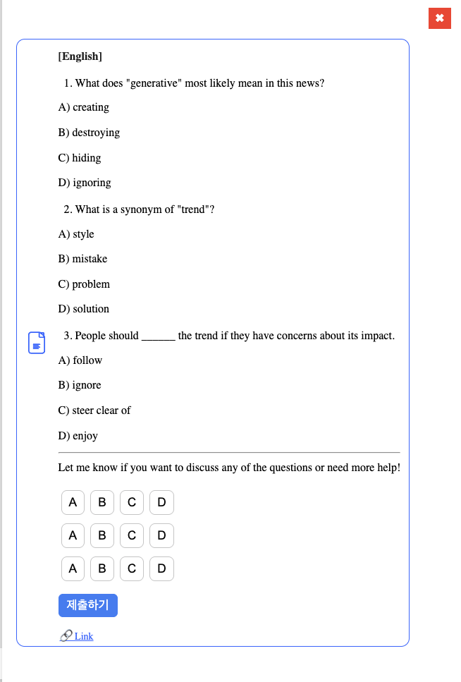
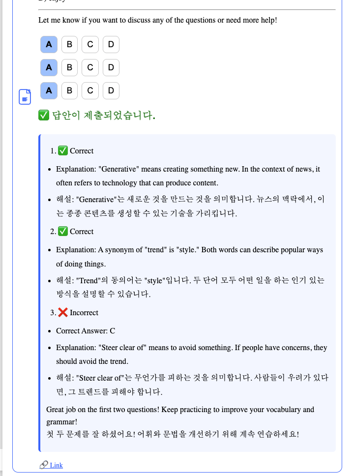
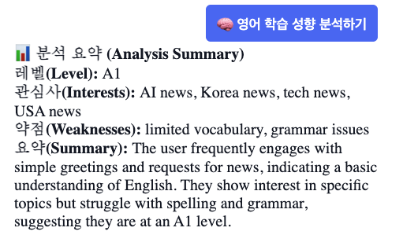

# Capstone Project 2025: 뉴스 기반 영어 학습 챗봇

**Capstone Project 2025: News-Based English Learning Chatbot**

**영어 뉴스로 배우는 맞춤형 영어 학습 챗봇 시스템**
**A personalized English learning chatbot powered by news content**

---

## 프로젝트 개요 | Project Overview

뉴스 기반 영어 학습을 위해 **LangChain + RAG 구조**를 활용하여, 사용자의 입력에 따라 적절한 뉴스 기사 요약과 함께 단어 및 문법 퀴즈를 제공하는 지능형 챗봇 시스템입니다.  
We use **LangChain + RAG architecture** to summarize news articles and generate vocabulary/grammar quizzes in response to user inputs.

* 최신 뉴스 요약 제공 | Provides up-to-date news summaries
* 단어/문법 기반 퀴즈 생성 | Generates vocabulary and grammar quizzes
* 사용자 맞춤 대화 흐름 및 피드백 | Personalized conversation and feedback
* 대화 이력 저장 및 사용자 성향 분석 | Logs chat history and analyzes user preferences

---

## 기술 스택 | Tech Stack

### Backend

* **FastAPI**: RESTful API 서버 | RESTful API server
* **LangChain**: RAG + Memory 기반 프롬프트 생성 | Prompt generation with LangChain
* **Weaviate**: 벡터 검색 기반 뉴스 문서 검색 | Vector-based news retrieval
* **PostgreSQL**: 사용자 및 대화 이력 저장 | Database for user & chat history
* **Docker**: 서비스 컨테이너화 | Containerized services
* **NewsAPI**: 뉴스 기사 수집 | Fetches news articles

### Frontend

* **React**: 사용자 인터페이스 | React-based UI

### AI Model

* OpenAI **GPT-4o-mini**

  * 뉴스 요약 | News summarization
  * 퀴즈 생성 | Quiz generation
  * 학습 피드백 제공 | Feedback for learning

---

## 디렉토리 구조 | Project Structure

```
Capstone-project-2025/
├── backend/
│   ├── api/               # FastAPI 라우터 (chat, user 등) | API routes
│   ├── services/          # LangChain 서비스 로직 | LangChain logic
│   └── db/                # SQLAlchemy 모델 및 CRUD | Database models
│
├── frontend/
│   └── src/
│       ├── components/    # Chatbot UI
│       ├── hooks/         # Custom hooks
│       └── pages/         # UI pages
├── docker/                # Docker & compose config
├── .env                   # 환경 변수 | Environment variables
└── README.md              # 프로젝트 설명 | Project description
```

---

## 기능 요약 | Feature Overview

| 기능        | 설명                      | Feature             | Description                          |
| --------- | ----------------------- | ------------------- | ------------------------------------ |
| 뉴스 검색     | 최신 뉴스 기사 수집 및 요약        | News Search         | Collect and summarize latest news    |
| GPT 응답    | 뉴스 기반 질의응답              | GPT Response        | AI-powered responses using news      |
| 영어 학습     | 문법 / 단어 퀴즈 자동 생성        | English Learning    | Automatic vocabulary/grammar quizzes |
| 사용자 DB 저장 | 유저별 세션, 대화 메시지 저장       | User Data Logging   | Store chat sessions per user         |
| 개인화 메모리   | LangChain 기반 사용자 메모리 생성 | Personalized Memory | User-aware prompts via LangChain     |
| 실시간 응답    | GPT 응답 스트리밍 처리          | Real-Time Streaming | Live response streaming to UI        |

---

## 주요 예시 | Example Demo

### 예시 질문 | Sample Question

> **"Tell me the latest news about AI."**

### 뉴스 응답 예시 | News Response


### 퀴즈 예시 | Quiz Example

**단어 퀴즈 | Vocabulary Quiz**  


**결과 예시 | Result Example**  


### 사용자 정보 저장 | User Info Logging



