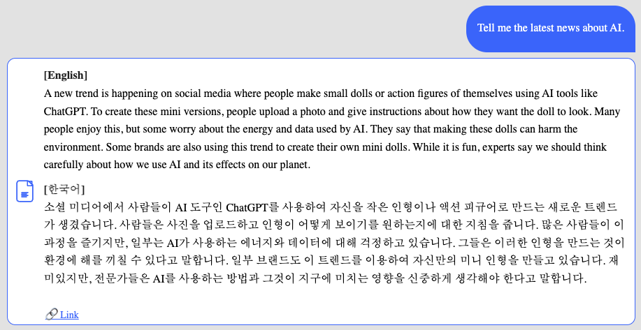

# Capstone Project 2025: 뉴스 기반 영어 학습 챗봇

**영어 뉴스로 배우는 맞춤형 영어 학습 챗봇 시스템**

## 프로젝트 개요

뉴스 기반 영어 학습을 위해 **LangChain + RAG 구조**를 활용하여, 사용자의 입력에 따라 적절한 뉴스 기사 요약과 함께 단어 및 문법 퀴즈를 제공하는 지능형 챗봇 시스템입니다.

* 최신 뉴스 요약 제공
* 단어/문법 기반 퀴즈 생성
* 사용자 맞춤 대화 흐름 및 피드백
* 대화 이력 저장 및 사용자 성향 분석

## 기술 스택

### Backend

* **FastAPI**: RESTful API 서버
* **LangChain**: RAG + Memory 기반 프롬프트 생성
* **Weaviate**: 벡터 검색 기반 뉴스 문서 검색
* **PostgreSQL**: 사용자 및 대화 이력 저장
* **Docker**: 서비스 컨테이너화
* **NewsAPI**: 뉴스 기사 수집

### Frontend

* **React**: 사용자 인터페이스

### AI Model

* OpenAI **GPT-4o-mini**

  * 뉴스 요약
  * 퀴즈 생성 (vocab, grammar)
  * 학습 피드백 제공

## 디렉토리 구조

```
Capstone-project-2025/
├── backend/
│   ├── api/               # FastAPI 라우터 (chat, user 등)
│   ├── services/          # LangChain 서비스 로직
│   └── db/                # SQLAlchemy 모델, 스키마, CRUD
│
├── frontend/
│   └── src/
│       ├── components/    # Chatbot UI
│       ├── hooks/         # 커스텀 훅 (useChat 등)
│       └── pages/         # ChatbotPage 등
├── docker/                # Docker 및 compose 설정
├── .env                   # 환경 변수
└── README.md              # 프로젝트 설명
```

## ⚙️ 기능 요약

| 기능           | 설명                           |
| ------------ | ---------------------------- |
| 뉴스 검색     | 최신 뉴스 기사 수집 및 요약             |
| GPT 응답    | 뉴스 기반 질의응답                   |
| 영어 학습     | 문법 / 단어 퀴즈 자동 생성             |
| 사용자 DB 저장 | 유저별 세션, 대화 메시지 저장            |
| 개인화 메모리   | LangChain 메모리 기반 사용자 프롬프트 생성 |
| 실시간 응답    | GPT 응답 스트리밍 처리               |


##  주요 예시

### 예시 질문

> "Tell me the latest news about AI."

- 관련 뉴스 기사 검색 및 요약


- 관련 문법/단어 퀴즈 생성


- 유저 대화 및 정보 저장


